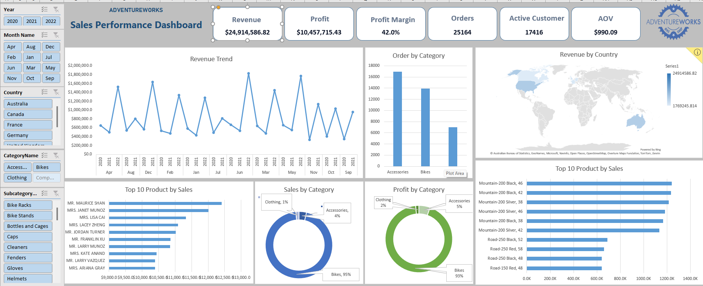

# AdventureWorks Excel Sales & Profitability Analysis

## 📊 Project Overview

An interactive **AdventureWorks Sales & Profitability Analysis** built in Microsoft Excel.

The project transforms raw sales and returns data into interactive dashboards that provide a clear view of revenue, profit, customers, orders, product performance, geographic performance, and returns.

## 🎯 Business Objectives

- Monitor sales and profitability performance
- Track key business KPIs
- Analyze revenue trends over time
- Identify top-performing products and categories
- Compare sales performance across countries
- Analyze customer and order activity
- Monitor product returns and return rates
- Identify products and categories with high return volumes

## 🛠️ Tools & Techniques

- Microsoft Excel
- Power Query
- Pivot Tables
- Pivot Charts
- Slicers
- Data Cleaning & Transformation
- KPI Analysis
- Interactive Dashboard Design

## 📁 Data

The analysis uses AdventureWorks datasets covering:

- Sales
- Customers
- Products
- Product Categories
- Product Subcategories
- Calendar
- Territories
- Returns

## 📈 Dashboard 1 — Sales Performance

The Sales Performance Dashboard includes:

- Revenue
- Profit
- Profit Margin
- Orders
- Active Customers
- Average Order Value (AOV)
- Revenue Trend
- Orders by Category
- Revenue by Country
- Top 10 Products by Sales
- Sales by Category
- Profit by Category

## 🔄 Dashboard 2 — Returns Analysis

The Returns Analysis Dashboard includes:

- Return Quantity
- Return Rate
- Return Cost
- Lost Revenue
- Lost Profit
- Return Trend
- Returns by Country
- Return Quantity by Category
- Returns by Subcategory
- Top 10 Returned Products

## 🔍 Analysis Workflow

1. Imported the raw AdventureWorks datasets
2. Cleaned and prepared the data
3. Organized lookup and transaction tables
4. Built analytical calculations
5. Created Pivot Tables and Pivot Charts
6. Added interactive slicers for filtering
7. Designed the Sales Performance Dashboard
8. Designed the Returns Analysis Dashboard
9. Extracted business insights from the results

## 💡 Key Insights

The dashboards make it possible to quickly identify:

- Overall revenue and profitability performance
- Sales trends across different periods
- High-performing products and categories
- Geographic differences in sales
- Customer and order activity
- Return patterns by country, category, and product
- Potential revenue and profit losses caused by product returns

## 👤 Author

**Ahmed Yassin**

Data Analyst | Excel | Power BI | SQL | Python

---

⭐ This project demonstrates practical Excel skills in data preparation, analysis, KPI development, visualization, and dashboard design.
